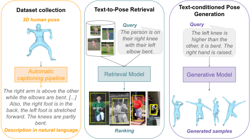

# 3D Human Poses from/with Natural Language.

This repository groups the official PyTorch implementations for the following two papers: 
* **["PoseScript: 3D Human Poses from Natural Language"](https://europe.naverlabs.com/research/computer-vision/posescript/)**, (**ECCV 2022**).
  *See branch `posescript` for the original code version.*
* **["PoseFix: Correcting 3D Human Poses with Natural Language"](https://europe.naverlabs.com/research/computer-vision/posefix/)**, (**ICCV 2023**)



The **PoseScript** ([download last version](https://download.europe.naverlabs.com/ComputerVision/PoseScript/posescript_release_v2.zip)) and the **PoseFix** ([download](https://download.europe.naverlabs.com/ComputerVision/PoseFix/posefix_dataset_release.zip)) datasets contain both human-written texts collected on Amazon Mechanical Turk and texts produced by the above-mentionned pipelines. Once downloaded, [explore PoseScript](./src/text2pose/posescript/README.md#🔮-take-a-quick-look) & [explore PoseFix](./src/text2pose/posefix/README.md#🔮-take-a-quick-look).

This code is divided in several parts, presented below. Click on the links to access to the respective READMEs, so as to get more details, to get instructions to train & evaluate the models, or to explore their results.
<!-- must use spaces for the markdown to show -->
<table>
<tbody>
<tr>
  <th>Dataset</th>
  <th align="center">Related Tasks</th>
</tr>
<tr>
  <td align="center">PoseScript</td>
  <td>

* [automatic captioning pipeline](./src/text2pose/posescript/README.md) *(producing descriptions)*
* [text-to-pose retrieval model](./src/text2pose/retrieval/README.md)
* [text-conditioned pose generation model](./src/text2pose/generative/README.md)
* [pose description generation model](./src/text2pose/generative_caption/README.md)

  </td>
</tr>
<tr>
  <td align="center">PoseFix</td>
  <td>

* [automatic comparative pipeline](./src/text2pose/posefix/README.md) *(producing modifiers)*
* [pose-pair-to-instruction retrieval model](./src/text2pose/retrieval_modifier/README.md)
* [text-guided pose editing model](./src/text2pose/generative_B/README.md)
* [pose-based correctional text generation model](./src/text2pose/generative_modifier/README.md)
      
  </td>
</tr>
</tbody>
</table>

## Setup


#### :snake: Create python environment

<details>
<summary>Click for details.</summary>
This code was tested in a python 3.7 environment.

From the main code directory:

```bash
pip install -r requirements.txt
python setup.py develop
```

If problems with OpenGL (setting: linux, anaconda3), check [here](https://stackoverflow.com/a/72427700).

**Note**: using cuda version 10.2 (please modify *requirements.txt* otherwise).

You may also have to run the following in a python interpreter:
```python
import nltk
nltk.download('punkt')
```
</details>


#### :inbox_tray: Download data

<details>
<summary>Click for details.</summary>
Both the PoseScript and the PoseFix datasets link human-written texts and automatically generated texts to poses from the AMASS dataset.

- The PoseScript dataset can be downloaded [here](https://download.europe.naverlabs.com/ComputerVision/PoseScript/posescript_release_v2.zip).
- The PoseFix dataset can be downloaded [here](https://download.europe.naverlabs.com/ComputerVision/PoseFix/posefix_dataset_release.zip).
- The AMASS dataset can be downloaded from [here](https://amass.is.tue.mpg.de/).
  <details>
    <summary>List of considered AMASS sub-datasets</summary>
    We used the following datasets in the <i>SMPL+H G</i> format:

    * ACCAD
    * BMLhandball
    * BMLmovi
    * BMLrub
    * CMU
    * DFaust
    * DanceDB
    * EKUT
    * EyesJapanDataset
    * HDM05
    * HumanEva
    * KIT
    * MoSh
    * MPI_Limits_PosePrior
    * SFU
    * SSM
    * TCDHands
    * TotalCapture
    * Transitions

    *Note: other sub-datasets in AMASS were probably added after we downloaded AMASS, which is why they are not considered there.*
  </details>
- The BABEL dataset can be downloaded from [here](https://babel.is.tue.mpg.de/data.html).
- The SMPL-H body models can be downloaded from [here](https://mano.is.tue.mpg.de/) by clicking on the link _"Extended SMPL+H model"_ on the download page.
- The GloVe pretrained word embeddings can be downloaded [here](https://nlp.stanford.edu/data/glove.840B.300d.zip).
</details>


#### :open_file_folder: Define important paths

<details>
<summary>Click for details.</summary>

*:warning: Please change paths in ./src/text2pose/config.py following your own preferences.*
- ***GENERAL_EXP_OUTPUT_DIR***: where models will be saved (along with logs, generated poses...)
- ***POSESCRIPT_LOCATION***: where PoseScript is located (vocabulary files & files related to automatic captions will be generated into this directory).
- ***POSESFIX_LOCATION***: where PoseFix is located (vocabulary files & files related to automatic modifiers will be generated into this directory).
- ***SMPLH_BODY_MODEL_PATH***: where SMPL-H body models are located.
- ***AMASS_FILE_LOCATION***: where AMASS is located.
- ***BABEL_LOCATION***: where BABEL is located.
- ***GLOVE_DIR***: where *glove.840B.300d.txt* is located (unzip the downloaded archive).
- ***TRANSFORMER_CACHE_DIR***: where the pretrained transformer checkpoints are located; see section _:books: Download language models_.

**Note**: the file *./src/text2pose/shortname_2_model_path.txt* (initially empty) holds correspondences between full model paths and model shortnames, for readable communication between generative and retrieval models. Lines should have the following format:
```
<model_shortname>    <model_full_path>
```
</details>

#### :closed_book: Generate the vocabulary
<!-- Needed for text generation, and if using the glovebigru text encoder -->

<details>
<summary>Click for details.</summary>

```bash
cd src/text2pose

# posescript vocab (needed to run the pretrained pose description generation model)
python vocab.py --dataset posescript \
--caption_files 'posescript_human_6293.json' 'posescript_auto_100k.json' \
--new_word_list '(' ')' '.' 'a' 'a-pose' 'a-shape' 'about' 'abstract' 'acting' 'action' 'activities' 'adjust' 'adjusting' 'adjustment' 'aim' 'aiming' 'aims' 'an' 'animal' 'argument' 'arm' 'arms' 'art' 'at' 'aupplauding' 'back' 'backwards' 'balance' 'balancing' 'ball' 'bartender' 'beaming' 'begging' 'behaving' 'behavior' 'bend' 'bending' 'bent' 'bird' 'body' 'bow' 'bowed' 'bowing' 'bump' 'bumping' 'call' 'cartwheel' 'catch' 'catching' 'celebrate' 'celebrating' 'charge' 'charging' 'check' 'checking' 'cheering' 'chicken' 'choking' 'chop' 'chopping' 'circular' 'clap' 'clapping' 'clasp' 'clasping' 'clean' 'cleaning' 'close' 'closing' 'collapsing' 'communicate' 'communicating' 'conduct' 'conducting' 'consuming' 'cough' 'coughing' 'cower' 'cowering' 'crawl' 'crawling' 'crossed' 'crossed-limbs' 'crossing' 'crouch' 'crouching' 'cry' 'crying' 'cuddling' 'cursty' 'curtsy' 'curtsying' 'cut' 'cutting' 'dance' 'dancing' 'defensive' 'delivering' 'desesperate' 'desesperation' 'despair' 'despairing' 'desperate' 'dip' 'direction' 'disagree' 'dive' 'diving' 'do' 'doing' 'down' 'dribble' 'dribbling' 'drink' 'drinking' 'drive' 'driving' 'drunk' 'drunken' 'duck' 'eat' 'eating' 'embracing' 'escaping' 'evade' 'evading' 'exercices' 'exercise/training' 'exercising' 'face' 'fall' 'falling' 'feet' 'fidget' 'fidgeting' 'fidgets' 'fight' 'fighting' 'fire' 'firing' 'fish' 'fishing' 'flail' 'flailing' 'flap' 'flapping' 'flip' 'flipping' 'floor' 'fluttering' 'food' 'foot' 'for' 'forward' 'gain' 'gesture' 'gesturing' 'get' 'getting' 'gifting' 'giggling' 'give' 'giving' 'glide' 'gliding' 'going' 'golf' 'golfing' 'grab' 'grabbing' 'grasp' 'grasping' 'greet' 'greeting' 'ground' 'gun' 'hacking' 'hair' 'hand' 'handling' 'hands' 'handstand' 'handstanding' 'hang' 'hanging' 'having' 'head' 'headstand' 'headstanding' 'hello' 'hi' 'hit' 'hitting' 'holding' 'hop' 'hopping' 'hug' 'hugging' 'imitating' 'in' 'incline' 'inclined' 'inclining' 'injured' 'inspecting' 'instrument' 'interact' 'interacting' 'interface' 'into' 'inward' 'jacks' 'jog' 'jogging' 'juggle' 'juggling' 'jump' 'jumping' 'kick' 'kicking' 'knee' 'kneel' 'kneeled' 'kneeling' 'knees' 'knelt' 'knock' 'knocking' 'lamenting' 'laugh' 'laughing' 'lead' 'leading' 'lean' 'leaning' 'leap' 'leaping' 'leg' 'legs' 'lick' 'licking' 'lie' 'lift' 'lifting' 'like' 'limbs' 'limp' 'limping' 'listen' 'listening' 'look' 'looking' 'lower' 'lowering' 'lunge' 'lunging' 'lying' 'making' 'march' 'marching' 'martial' 'middle' 'mime' 'mimicking' 'miming' 'misc' 'mix' 'mixing' 'moonwalk' 'moonwalking' 'motion' 'move' 'movement' 'movements' 'moving' 'musique' 'navigate' 'object' 'of' 'on' 'open' 'opening' 'operate' 'operating' 'or' 'orchestra' 'original' 'over' 'part' 'pat' 'patting' 'perform' 'performance' 'performing' 'person' 'phone' 'picking' 'place' 'placing' 'play' 'playing' 'plays' 'plead' 'pleading' 'point' 'pointing' 'pose' 'poses' 'position' 'practicing' 'pray' 'prayer' 'praying' 'prepare' 'preparing' 'press' 'pressing' 'protect' 'protecting' 'punch' 'punching' 'quivering' 'raising' 'reaching' 'relax' 'relaxation' 'relaxing' 'release' 'releasing' 'remove' 'removing' 'reveal' 'rocking' 'rolling' 'rope' 'rub' 'rubbing' 'run' 'running' 'salute' 'saluting' 'saying' 'scratch' 'scratching' 'search' 'searching' 'seizing' 'series' 'shake' 'shaking' 'shape' 'shave' 'shaving' 'shivering' 'shooting' 'shoulder' 'showing' 'shrug' 'shrugging' 'shuffle' 'side' 'sideways' 'sign' 'sit' 'sitting' 'skate' 'skating' 'sketch' 'skip' 'skipping' 'slash' 'slicing' 'slide' 'sliding' 'slightly' 'smacking' 'smell' 'smelling' 'snack' 'snacking' 'sneak' 'sneaking' 'sneeze' 'sneezing' 'sobbing' 'some' 'someone' 'something' 'somethings' 'speaking' 'spin' 'spinning' 'sport' 'sports' 'spread' 'spreading' 'squat' 'squatting' 'stagger' 'staggering' 'stances' 'stand' 'standing' 'staring' 'step' 'stepping' 'stick' 'stomp' 'stomping' 'stop' 'strafe' 'strafing' 'stretch' 'stretching' 'stroke' 'stroking' 'stumble' 'stumbling' 'style' 'styling' 'sudden' 'support' 'supporting' 'sway' 'swaying' 'swim' 'swimming' 'swing' 'swinging' 'swipe' 'swiping' 't' 't-pose' 't-shape' 'take/pick' 'taking' 'tap' 'tapping' 'telephone' 'tentative' 'the' 'things' 'throw' 'throwing' 'tie' 'tiptoe' 'tiptoeing' 'tiptoes' 'to' 'touch' 'touching' 'training' 'transition' 'trashing' 'trip' 'tripping' 'try' 'trying' 'tumbling' 'turn' 'turning' 'twist' 'twisting' 'twitching' 'tying' 'uncross' 'unknown' 'up' 'up/down' 'upper' 'using' 'vocalise' 'vocalizing' 'voice' 'voicing' 'vomit' 'vomitting' 'waist' 'wait' 'waiting' 'walk' 'walking' 'wash' 'washing' 'wave' 'waving' 'weeping' 'wiggle' 'wiggling' 'with' 'with/use' 'wobble' 'wobbling' 'worry' 'worrying' 'wrist' 'wrists' 'write' 'writing' 'yawn' 'yawning' 'yoga' 'zombie' \
--make_compatible_to_side_flip \
--vocab_filename 'vocab_posescript_6293_auto100k.pkl'

# posefix vocab (needed to run the pose-based correctional text generation model)
python vocab.py --dataset posefix \
--caption_files 'posefix_human_6157.json' 'posefix_auto_135305.json' 'posefix_paraphrases_4284.json' \
--make_compatible_to_side_flip \
--vocab_filename vocab_posefix_6157_pp4284_auto.pkl

# posemix vocab
python vocab.py --dataset posemix \
--caption_files '<POSESCRIPT_LOCATION>/posescript_human_6293.json' '<POSEFIX_LOCATION>/posefix_human_6157.json' '<POSEFIX_LOCATION>/posefix_paraphrases_4284.json' \
--make_compatible_to_side_flip \
--vocab_filename vocab_posemix_PS6193_PF6157.pkl 
```

The filenames provided in argument for generating the PoseScript or the PoseFix vocabularies are expected to be in ***POSESCRIPT_LOCATION*** and ***POSEFIX_LOCATION*** respectively. The vocabularies will be saved in those same directories. They are expected to be of size 2158 for PoseScript and 2374 for PoseFix (1112 when not considering the paraphrases).
</details>


#### :books: Download language models

<details>
<summary>Click for details.</summary>

Download HuggingFace checkpoints, by running the following python script:
```python
import os
from transformers import AutoTokenizer, AutoModel
import config

model_type = "distilbert-base-uncased"

# download the tokenizer
tokenizer = AutoTokenizer.from_pretrained(model_type)
tokenizer.save_pretrained(os.path.join(config.TRANSFORMER_CACHE_DIR, model_type))

# download the encoder
text_enc = AutoModel.from_pretrained(model_type)
text_enc.save_pretrained(os.path.join(config.TRANSFORMER_CACHE_DIR, model_type))
```
</details>

## Explore datasets

After downloading the datasets, run the following:

```bash
streamlit run <dataset>/explore_<dataset>.py
```

with `<dataset>` being either `posescript` or `posefix`.

## Visualize results of pretrained models

- [:inbox_tray: **Download** pretrained models](./pretrained_models.md#download-links)
- **Unzip** the archive and place the content of the resulting directory in ***GENERAL_EXP_OUTPUT_DIR***
- **Add lines** in file *./src/text2pose/shortname_2_model_path.txt* following this format:
  ```
  <model shortname><4 spaces><path to the model>
  ```
  You can copy lines from [here](./pretrained_models.md#references-in-shortname_2_model_path).

- **Launch a demo**:
  ```bash
  streamlit run <type>/demo_<type>.py -- --model_path </path/to/model.pth>
  ```
  with:
    - `<type>` being one of `retrieval`|`retrieval_modifier`|`generative`|`generative_B`|`generate_caption`|`generate_modifier`;
    - `</path/to/model.pth>` being any model full path of the required type; if you followed to procedure, you can find them in *./src/text2pose/shortname_2_model_path.txt*

## Train & Evaluate models

Please refer to the README of the model of interest in this repo subdirectories. Get quick access from the table at the top.

## Citation

If you use this code, the PoseScript dataset or the PoseFix dataset, please cite the corresponding paper:

```bibtex
@inproceedings{delmas2022posescript,
  title={{PoseScript: 3D Human Poses from Natural Language}},
  author={{Delmas, Ginger and Weinzaepfel, Philippe and Lucas, Thomas and Moreno-Noguer, Francesc and Rogez, Gr\'egory}},
  booktitle={{ECCV}},
  year={2022}
}
```

```bibtex
@inproceedings{delmas2023posefix,
  title={{PoseFix: Correcting 3D Human Poses with Natural Language}},
  author={{Delmas, Ginger and Weinzaepfel, Philippe and Moreno-Noguer, Francesc and Rogez, Gr\'egory}},
  booktitle={{ICCV}},
  year={2023}
}
```

## License

This code is distributed under the CC BY-NC-SA 4.0 License. See [LICENSE](LICENSE) for more information.

Note that some of the softwares to download and install for this project are subject to separate copyright notices and license terms, which use is subject to the terms and conditions under which they are made available; see for instance [VPoser](https://github.com/nghorbani/human_body_prior).