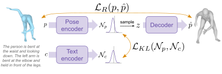

# Text-conditioned Generative Model for 3D Human Poses

_:warning: In what follows, command lines are assumed to be launched from `./src/text2pose`._

_:warning: The evaluation of this model relies partly on several [text-to-pose retrieval model](../retrieval/README.md), see section **Extra setup**, below._

## Model overview

* **Input**: pose description;
* **Output**: 3D human pose.



## :crystal_ball: Demo

To generate poses based on a pretrained model and your own input description, run the following:

```
streamlit run generative/demo_generative.py -- --model_paths </path/to/model.pth>
```

:bulb: Tips: _Specify several model paths to compare models together._

## Extra setup

At the beginning of the bash script, assign to variable `fid` the shortname of the trained [text-to-pose retrieval model](../retrieval/README.md) to be used for computing the FID.

Add a line in *shortname_2_model_path.txt* to indicate the path to the model corresponding to the provided shortname.

## :bullettrain_front: Train

:memo: Modify the variables at the top of the bash script to specify the desired model & training options.

Then use the following command:
```
bash generative/script_generative.sh 'train' <training phase: pretrain|finetune> <seed number>
```

**Note for the finetuning step**: In the script, `pretrained` defines the nickname of the pretrained model. The mapping between nicknames and actual model paths is given by *shortname_2_model_path.txt*. This means that if you train a model and intend to use its weights to train another, you should first write its path in *shortname_2_model_path.txt*, give it a nickname, and write this nickname in front of the `pretrained` argument in the script. The nickname will appear in the path of the finetuned model.

## :dart: Evaluate

Use the following command:
```
bash generative/script_generative.sh 'eval' <evaluation phase: regular|generate_poses|RG|GRa|GRb> <additional arguments (see table below)...>
```

Expected additional arguments include:

| evaluation phase (`eval_type`) | expected additional arguments | needed to get... |
|---|---|---|
| `regular` | model path | **elbo**, **fid** |
| `generate_poses` | model path, seed number | **mRecall R/G** (step 1/2), **mRecall G/R** (step 1/3) |
| `RG` | seed number, shortname of the evaluated generative model, retrieval model shortname | **mRecall R/G** (step 2/2) |
| `GRa` | seed number, shortname of the evaluated generative model | **mRecall G/R** (step 2/3) |
| `GRb` | seed number, shortname to the model trained in previous step | **mRecall G/R** (step 3/3) |

In the above table, "model path" is the path to the generative model to be evaluated.

_**Important note**: the fid, mRecall R/G, and mRecall G/R rely on trained retrieval models._

## Generate and visualize pose samples for the dataset

For evaluation, *generative/script_generative.sh* makes the model generate pose samples for each caption of the dataset, thanks to the following command:

```
python generative/generate_poses.py --model_path <model_path> 
```

The generated pose samples can be visualized, along with the original pose and the related description, by running the following:

```
streamlit run generative/look_at_generated_pose_samples.py -- --model_path <model_path> --dataset_version <dataset_version> --split <split>
```
