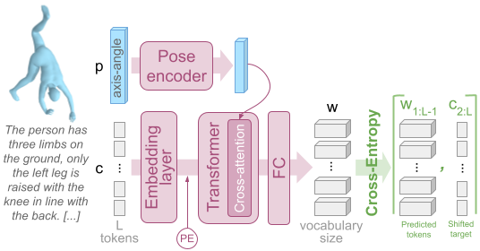

# Pose Description Generation Model

_:warning: In what follows, command lines are assumed to be launched from `./src/text2pose`._

_:warning: The evaluation of this model relies partly on a [text-to-pose retrieval model](../retrieval/README.md) and a [text-conditionned pose generation model](../generative/README.md), see section **Extra setup**, below._

## Model overview

* **Input**: 3D human pose;
* **Output**: pose description.



## :crystal_ball: Demo

To generate text descriptions based on a pretrained model and example 3D human poses, run the following:

```
streamlit run generative_caption/demo_generative_caption.py -- --model_paths </path/to/model.pth>
```

:bulb: Tips: _Specify several model paths to compare models together._

## Extra setup

At the beginning of the bash script, indicate the shortnames of the trained models used for evaluation:
* `fid`: text-to-pose retrieval model ([info](../retrieval/README.md)),
* `pose_generative_model`: text-to-pose generative model ([info](../generative/README.md)),
* `textret_model`: text-to-pose retrieval model, eg. the same as for `fid` ([info](../retrieval/README.md)).

Indicate the paths to the models corresponding to each of these shortnames in *shortname_2_model_path.txt*.

## :bullettrain_front: Train

:memo: Modify the variables at the top of the bash script to specify the desired model & training options.

Then use the following command:
```
bash generative_caption/script_generative_caption.sh 'train' <training phase: pretrain|finetune> <seed number>
```

**Note for the finetuning step**: In the script, `pretrained` defines the nickname of the pretrained model. The mapping between nicknames and actual model paths is given by *shortname_2_model_path.txt*. This means that if you train a model and intend to use its weights to train another, you should first write its path in *shortname_2_model_path.txt*, give it a nickname, and write this nickname in front of the `pretrained` argument in the script. The nickname will appear in the path of the finetuned model.

## :dart: Evaluate

Use the following command:
```
bash generative_caption/script_generative_caption.sh 'eval'  </path/to/model.pth>
```
