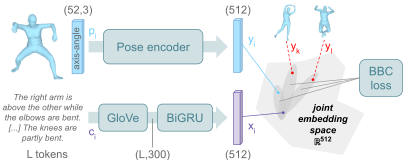

# Text-to-Pose Retrieval

 _:exclamation: In what follows, command lines are assumed to be launched from `./src/text2pose`._

## :crystal_ball: Demo

To look at a ranking of poses referenced in PoseScript by relevance to your own input description, using a pretrained model, run the following:

```
streamlit run retrieval/demo_retrieval.py -- --model_path </path/to/model.pth>
```

**Additional arguments include:**
- `--n_retrieve`: number of poses to retrieve for each query
- `--split`: split in which poses are retreived (`train`|`test`|`val`)

## :bullettrain_front: Train & :dart: Evaluate

Train, then eval, on automatically generated captions:
```
bash retrieval/script_retrieval.sh -a train-eval -c ret_glovebigru_vocA1H1_dataA1
```

Finetune, then eval, on human-written captions:
```
bash retrieval/script_retrieval.sh -a train-eval -c ret_glovebigru_vocA1H1_dataA1ftH1
```

**Possible arguments are:**
- `-a` (*action*): `train`, `eval` or `train-eval` (to eval directly after training).
- `-c` (*config*): shortname for the experiment and model to run. Configs are detailed in the script.
- `-s` (*seed*; optional): seed value, for reproducibility; useful to distinguish between different runs of a same model.
- `-g` (*generated_pose_samples*; optional): shortname for the generative model that generated the pose samples to train on.

## Model overview


