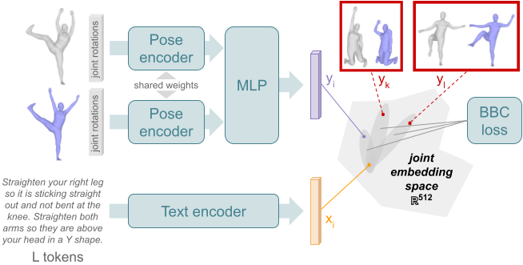

# {Pose-Pair :left_right_arrow: Instruction} Retrieval Model

_:warning: In what follows, command lines are assumed to be launched from `./src/text2pose`._

## Model overview

**Possible inputs**: a pair of 3D human poses (ie. two elements at once), text instruction.



## :crystal_ball: Demo

To look at a ranking of text instruction (resp. pose pair) referenced in PoseFix by relevance to a chosen pose pair (resp. text instruction), using a pretrained model, run the following:

```
bash retrieval_modifier/script_retrieval_modifier.sh 'demo' </path/to/model.pth>
```

## :bullettrain_front: Train

:memo: Modify the variables at the top of the bash script to specify the desired model & training options.

Then use the following command:
```
bash retrieval_modifier/script_retrieval_modifier.sh 'train' <training phase: pretrain|finetune> <seed number>
```

## :dart: Evaluate

Use the following command (test on PoseFix-H):
```
bash retrieval_modifier/script_retrieval_modifier.sh 'eval' </path/to/model.pth>
```